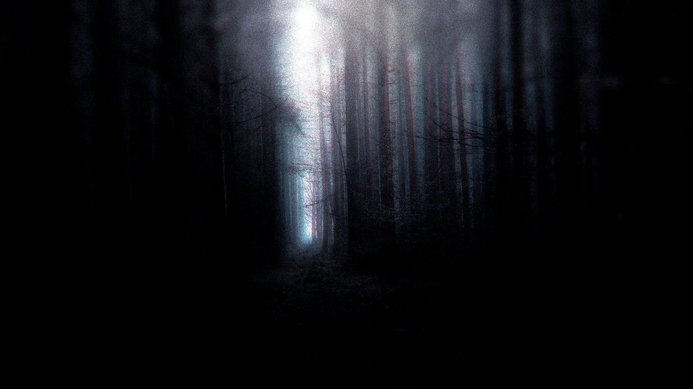

# Twisted Creations Homepage

  <kbd></kbd>
  <h3>Official Website for Twisted Creations Game Studio</h3>

## 📋 Overview

This repository contains the source code for the official Twisted Creations website. Our site showcases our game development studio, team members, and our upcoming game projects including "Abandoned: The Asylum of Madness."

## 🎮 About Twisted Creations

We are a passionate group of game developers focused on creating high-quality gaming experiences using Godot 4. Our first major project is "Abandoned: The Asylum of Madness" (ATAM), which is part of our "Twisted Childhood Memories" series.

## 🚀 Website Features

- Responsive design that works on all devices (desktop, tablet, mobile)
- Information about our studio and development philosophy
- Details about our team members and their roles
- Updates on our current and upcoming game projects

## 🛠️ Development Status

This website is currently a work in progress and is being actively developed. Features and content are continuously being added and improved.

## 📱 Mobile Support

Our website is fully responsive and optimized for mobile devices of all sizes.

## 👥 Contributors

- [Venage5603](https://youtube.com/@Venage5603) - Director, Coder, Level Designer
- Chrxz - Play Tester

## 📞 Contact

For more information about Twisted Creations, please visit our website or contact us through our social media channels.

---

&copy; 2025 Twisted Creations. All rights reserved.
